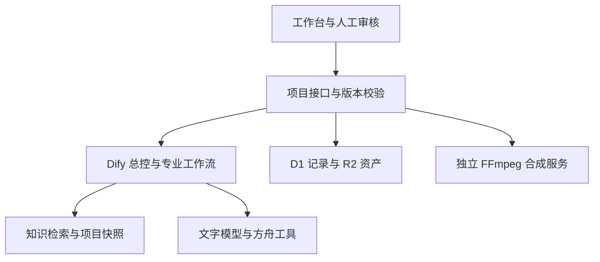

# WOO Agent Workbench

面向校园营销与内容团队的 Agent 工作台：把项目资料、创作流程、人工审核和线上线下交付组织到同一个工作空间。

**公开演示源码 · 合成资料 · Dify 工作流模板 · 尚未完成真实业务全链验收**

项目源于校园营销场景，尝试解决简报与资料分散、跨平台内容反复改写、生成结果难以追溯、线上创作与线下执行脱节等问题。当前公开版移除了真实策划案、结案文件、品牌原图、现场照片、账户绑定和运行日志。

## 核心能力

- 三个主工作区：项目总览、项目执行、资料资产管理。
- 五个 Dify 业务应用组织七类角色：调研、策略、选题、海报、脚本、图文、复盘。
- 四类知识材料：结案、品牌工作规范、历史计划、渠道内部模板；可变项目状态按运行快照提供。
- 四海报与四平台文案批次：版本冻结、预算约束、后台推进、人工审批、部分交付。
- 海报背景与文字分层：改字不触发生图，字体、素材和交付文件使用 SHA-256 核验。
- 失败恢复：未知提交保留原运行号，先查原结果，避免盲目重复生成与付费。
- 视频镜头、关键帧、音轨、字幕及合成服务接口；线下物料、采购、分工与 RGB 印前核对稿。

## 系统关系



模型结果先进入待审核状态。任务状态、预算、审批与文件版本由程序管理；生成内容不自动发布、不自动完成采购，也不把历史活动成果计入 AI 项目收益。

## 运行本地工作台

需要 Node.js **22.13 或更新版本**、npm，以及项目锁定依赖。默认是 portable 执行配置，无需安装 ChatGPT 插件。

```sh
npm ci
npm run build
```

先为本地 D1 应用数据库迁移：

```sh
node --import ./scripts/sites-env.mjs ./node_modules/wrangler/bin/wrangler.js d1 execute DB --local --config dist/server/wrangler.json --persist-to .wrangler/state --file drizzle/0000_exotic_mastermind.sql
```

迁移文件名以 `drizzle/` 中实际 `.sql` 文件为准。然后：

```sh
npm run dev
```

打开终端输出的本地 URL。首次读取会创建**明确标注的合成示例项目**。本地开发支持模拟登录 `/signin-with-chatgpt?return_to=/`；这是开发工具，不是生产认证。

未配置模型时，可以查看工作台、编辑项目与任务、整理资料。模型生成保持不可用，不会自动消耗额度。要启用生成，把 `.env.example` 复制为 `.dev.vars` 并填入自己的配置，完成 [Dify 接入步骤](docs/DIFY-SETUP.md)。

> 本仓库不会连接作者的生产账户、数据库、私有站点或模型额度。生产认证原由托管平台负责；如果自行部署公开服务，需要接入自己的认证、授权和项目访问隔离，不能把本地模拟登录直接用于生产。

## 验证

```sh
npm run typecheck
npm run test:public
npm run test:contracts
npm run test:production
```

测试使用 SQLite/R2 替身、合成图片与模拟模型响应，不调用真实付费模型。它们验证版本、预算、审核、恢复与归档合同；不证明生成质量、业务收益或真实平板交互体验。

FFmpeg 本地合成验证需要 Python、Pillow、FFmpeg、ffprobe，见 [合成服务说明](services/render-worker/README.md)。生产合成需要另行配置持久服务。

## 当前边界

| 能力 | 当前状态 |
| --- | --- |
| 工作台、任务、资料、预算、审批、版本与恢复 | 已实现；公开版使用合成数据 |
| Dify 五应用、七角色、四知识库 | 提供脱敏模板；需在自己的工作区重新绑定 |
| 海报与文案生成 | 有接口、归档及人审流程；需配置模型和批准素材 |
| 视频合成 | 本地服务代码与合同测试；不包含已运行的生产服务器 |
| 印前输出 | RGB 核对稿；未实现印厂 ICC/CMYK 正式交付验收 |
| 效果评估 | 未完成真实用户对照、检索效果评测和完整活动成果验证 |

[设计取舍与性能](docs/DESIGN-DECISIONS.md) · [发布内容范围](docs/PUBLIC-RELEASE.md) · [第三方说明](THIRD_PARTY_NOTICES.md)

## 目录

| 路径 | 用途 |
| --- | --- |
| `app/`、`components/` | 页面、交互与 HTTP 接口 |
| `lib/` | 业务契约、版本、生成、审核、预算与归档逻辑 |
| `dify/workflows/` | 五个脱敏 DSL 模板 |
| `dify/knowledge/` | 四个合成知识材料 |
| `services/render-worker/` | 独立持久视频合成服务 |
| `scripts/verify-*.mjs` | 契约与业务回归验证 |

公开发布不代表品牌官方产品，也没有复制原生产 Git 历史。项目使用 AI 辅助开发；评估项目时应关注需求判断、流程约束与验证证据。源码尚未指定额外开源许可，第三方资产沿用各自许可。
